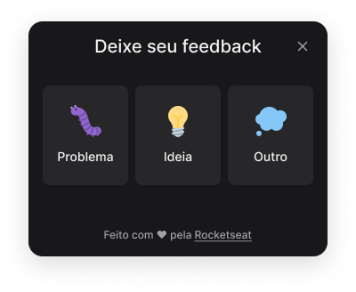
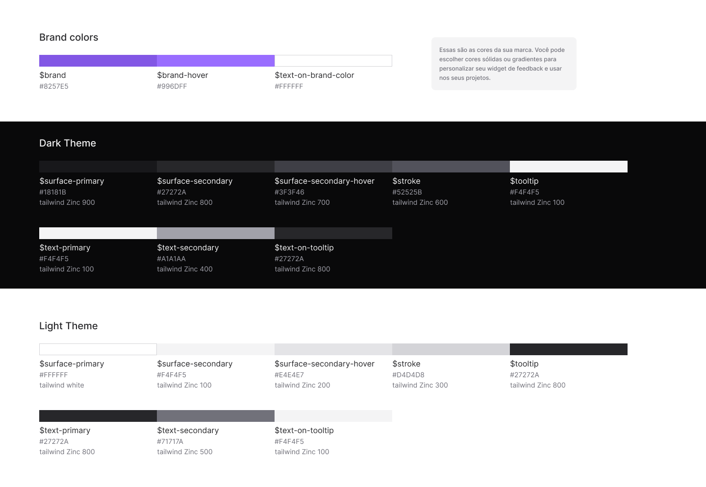
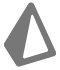
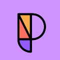

<div align="center" id="top">
  

<div align="center">
  

&#xa0;

<h1 align="center">NLW #08 - Return</h1>

<p align="center">
    
    
    
    
</p>
<p align="center">
  <a href="#dart-sobre">Sobre</a> &#xa0; | &#xa0;
  <a href="#sparkles-funcionalidades">Funcionalidades</a> &#xa0; | &#xa0;
  <a href="#desktop_computer-screenshots")>Screenshots</a> &#xa0; | &#xa0;
  <a href="#hammer_and_wrench-tecnologias-utilizadas">Tecnologias e Bibliotecas</a> &#xa0; | &#xa0;
  <a href="#gear-instalação">Instalação</a> &#xa0; | &#xa0;
  <a href="#memo-licença">Licença</a> &#xa0;
</p>
<br>

## :dart: Sobre
Next Level Week Heat é a 8º edição do evento oferecido pela [Rocketseat](https://rocketseat.com.br) para a comunidade.
Nessa edição na trilha Impulse foi desenvolvida um widget completo e acessível que pode ser utilizado em múltiplos projetos para coletar feedbacks e reports dos usuários, todo o backend e frontend da aplicação foi feito em ReactJS (TS) sob mentoria do [Diego Fernandes](https://github.com/diego3g), e a aplicação em sua versão mobile (React Native) junto com o [Rodrigo](https://github.com/rodrigorgtic). 🚀

## :sparkles: Funcionalidades

:heavy_check_mark: Animação ao clicar no botão Feedback;\
:heavy_check_mark: Abrir Popover;\
:heavy_check_mark: Realizar Screenshot da Tela;\
:heavy_check_mark: Enviar email com o feedback;

## :desktop_computer: Screenshots
<div align="center">
  
  
  
  
  </div>

## :hammer_and_wrench: Tecnologias utilizadas
<div style="display: flex">
  <a href="https://reactnative.dev/"> React Native</a><br/>

  <a href="https://reactjs.org/"> React</a><br/>
  
  <a href="https://www.typescriptlang.org/"> Typescript</a><br/>
  
  <a href="https://reactjs.org/"> HTML</a><br/>
  
  <a href="https://sass-lang.com/"> TailwindCSS</a><br/>
  
  <a href="https://nodejs.org/"> Node</a><br/>

  <a href="https://prisma.io/"> Prisma</a><br/>
  
  <a href="https://jest.io/"> Jest</a><br/>

  <a href="https://phosphoricons.com/"> Phosphor Icons</a><br/>

  <a href="https://vitejs.dev/"> Vite JS</a><br/>
</div>

## :gear: Instalação

DEV
```bash
# Clone o repositório
$ git clone https://github.com/taohansens/NLW-return.git

# Entre no repositório
$ cd NLW-return

# Selecione um dos diretórios
$ cd web
$ cd mobile
$ cd server

# Variáveis .ENV (Configuração Inicial)
$ DATABASE_URL="file:./dev.db"

# Instale as dependências
$ npm install

# Execute a aplicação
$ npm run dev
```

## :memo: Licença

Esse projeto está sob licença MIT. Para mais detalhaes, veja o arquivo [LICENSE](LICENSE.md).

Feito com :heart: por <a href="https://github.com/taohansens" target="_blank">Tao Hansen</a>

&#xa0;

<a href="#top">Voltar ao topo</a>
